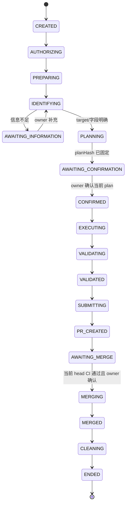
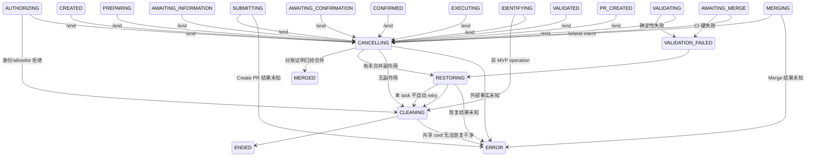

# ops-base MVP 裁剪分析

> 文档性质：MVP 范围裁剪，不扩展《Base Skill 模块接口协议》，不新增协议字段，不修改现有代码。
>
> 设计依据：`docs/base-skill-module-interface-protocol.md`、`docs/schema-ops-capability-spec.md`、`docs/ops-base-task-persistence-design.md`，并以 `agent-src/.pi/scripts/lark-bot.ts`、现有业务 Skill、validator、content-pr 和 CI 为当前实现基线。本文统一使用 `ops-base` 表示完整模块；`ops-base Skill` 仅指 Agent 行为说明。
>
> 目标：在当前 lark-bot 多 PI RPC 进程架构和共享 Git cwd 上，先交付一个可恢复、可取消、可创建并合并 content PR 的最小闭环。

## 实现阶段状态（2026-08）

本文第 0.4 节定义的是**完整 MVP 上线条件**，并非当前每个开发阶段均已达成的事实。当前 D3 仅完成「可信 ingress → 固定 updateTeam plan → 原 operator 确认 → runtime-root candidate artifact」的无副作用 checkpoint：它不创建 content branch、不写共享 workspace、不运行 before/after validator、不创建 PR，因而**不满足第 0.4 节的 MVP 完成定义**。branch/pendingEffect/受控写入/validator/PR/CI/`/end` 仍属于后续阶段；在这些阶段落地前，PR 和运行时均不得把 candidate artifact 表述为已提交的运营变更。

## 0. 裁剪结论

### 0.1 标记说明

| 标记 | 含义 |
|---|---|
| **【MVP 阻塞】** | 不完成就不能安全上线第一版，或会造成身份混淆、并发覆盖、重复 PR/Merge、错误数据进入 main |
| **【延期－人工补偿】** | 第一版发生时允许停止自动流程，由运营或开发者按检查单处理；不得自动猜测或继续副作用 |
| **【延期－非核心】** | 不影响“飞书请求 → 确认 → 修改 → 校验 → PR → CI → 合并/取消 → ENDED”核心闭环 |

### 0.2 第一版只做一个业务能力

MVP 只开放：

```text
updateTeam：一次任务只更新一个队伍的 phase / bossHP / isLive
```

限制：

- target 必须绑定稳定 team `id`；
- 一次任务只能操作一个 team；
- 只能修改用户明确确认的 `phase`、`bossHP`、`isLive`；
- phase 只接受当前事实值 `P1/P2/P3/P4/CLEAR`；
- phase 不得后退，bossHP 不得上升；
- 不启用 `FINAL/P5`，不自动执行 `CLEAR + 0 → isLive=false`；
- 不允许修改 rank、name、players、region 或其他集合。

选择 updateTeam 的原因：

- 当前已有 `update-team` Skill、team Schema、`PHASE_ORDER` 和页面消费逻辑；
- 变更是一个既有数组项上的少量标量字段，不需要先实现通用 identity-aware 插入 diff；
- 可以验证完整的确认、before/after、PR、CI、Merge 和 `/end` 闭环；
- news Skill 当前仍使用错误的 `title` 和时间格式，broadcaster 当前仍有占位数据，不适合作为第一版入口。

### 0.3 核心裁剪决定

| 领域 | MVP 决定 | 标记 |
|---|---|---|
| 并发 | 全系统同一时刻最多一个非 ENDED 运营任务 | **【MVP 阻塞】** |
| Workspace | 保留当前共享 Git cwd；全任务周期持有全局 mutation lock | **【MVP 阻塞】** |
| PI 进程 | 保留当前 `p2p` / `group:<chatId>` 进程模型 | 复用现状 |
| PI session | 每个任务开始前对选中的现有 PI 进程执行 `new_session`，不新建 task process | **【MVP 阻塞】** |
| 业务范围 | 只开放 updateTeam | **【MVP 阻塞】** |
| Schema | 继续使用当前标准 JSON Schema + `constants.js` | 复用现状 |
| `x-ops` | 不在 MVP 启用 capability compiler | **【延期－非核心】** |
| 业务入口 | updateTeam 的识别、计划、确认和状态推进全部归 ops-base；`update-team` 文件只保留为迁移规则参考，运行时不得调用 | **【MVP 阻塞】** |
| Validator | 在当前 validator/OP_LOG diff 上增加 updateTeam 专用 before/after 硬检查 | **【MVP 阻塞】** |
| 权限 | 使用完整 `feishuOpenId` 的静态 allowlist；只授权 MVP 唯一 operation | **【MVP 阻塞】** |
| PR | ops-base Runtime adapter 复用 content-pr 的 Git/gh 命令；SKILL.md 不执行副作用 | **【MVP 阻塞】** |
| CI | 复用现有 GHA，权限失败全部 hard fail，updateTeam diff 必须精确匹配 | **【MVP 阻塞】** |
| 任务持久化 | 只实现原子 `state.json`、baseline、validation report、change record | **【MVP 阻塞】** |
| events/summary | 第一版不生成 `events.jsonl` 和 `summary.json` | **【延期－非核心】** |
| 结束通道 | 不实现 `ops_task_finalize`；bot 在 `agent_settled` 后读取 state 判定任务是否结束 | **【延期－非核心】** |
| Session 删除 | task 结束后不删共享 PI 进程/session 目录；下一任务前强制 `new_session` | **【延期－人工补偿】** |
| Webhook/poller | 不实现持续后台轮询；在“合并”、启动恢复和取消时查询 GitHub 事实 | **【延期－非核心】** |
| 同 task 自动重试 | validation/CI 失败后结束当前 task，由用户创建新 task | **【延期－人工补偿】** |

### 0.4 MVP 上线定义

只有以下路径全部通过，才算 MVP 完成：

```text
飞书 updateTeam 请求
→ 完整身份授权
→ 持久 taskId/state
→ 用户确认固定 plan
→ 修改共享 workspace
→ 本地 before/after 硬校验
→ 创建 content PR
→ CI 独立通过
→ 原 operator 确认当前 head
→ squash merge
→ workspace 恢复干净 main
→ ENDED(MERGED)
```

并且：

```text
任意未合并阶段 /end
→ 停止正常推进
→ 关闭未合并 PR（如有）
→ 恢复 baseline/共享 cwd，记录 branch 处置结果
→ ENDED(CANCELLED)
```

### 0.5 MVP 信任前提

第一版只适用于以下边界：

- 飞书入口只开放给少量 allowlist operator；
- allowlist operator、部署主机、项目内 extension 和 GitHub App 被视为可信；
- 不把同 OS 用户下的恶意本地进程隔离纳入第一版；
- 任一不可信/不唯一外部事实都进入 ERROR，不靠 Agent 猜测。

如果需要抵御恶意本地进程或任意飞书用户的 prompt injection，必须先增加运行时隔离，不能把本 MVP 直接扩大开放范围。

### 0.6 统一术语和代码边界

从 MVP 第一版开始，`ops-base` 明确拆为两部分：

```text
ops-base
├── Agent 层
│   └── .pi/skills/ops-base/SKILL.md
│       ├── 理解用户文本
│       ├── 按 Runtime 返回的信息提问/展示操作单
│       └── 调用受控 Runtime tool
│
└── Runtime 层（Pi Extension + 确定性 TypeScript 代码）
    └── .pi/extensions/ops-base/
        ├── index.ts                    # Pi 自动发现入口；注册窄 tool/event hook
        └── runtime/
            ├── task-store
            ├── state transition guards
            ├── updateTeam MVP rule/validator
            ├── pendingEffect 与 Git/GitHub adapter
            └── restart recovery helpers
```

Pi 官方只自动发现 `.pi/skills/` 和 `.pi/extensions/` 等约定资源；`.pi/scripts/` 不是 Pi 的自动发现目录。现有 `.pi/scripts/lark-bot.ts` 可以继续作为显式启动的宿主脚本，并导入 ops-base Runtime 的纯模块，但安全核心不应仅作为等待 Agent 通过 bash 调用的脚本集合。

Pi Skill 规范也允许在 `.pi/skills/ops-base/scripts/` 放 helper scripts；该位置适合“按 SKILL.md 指引由 Agent 调用”的辅助程序，不适合承载必须自动执行、可拦截调用并强制 CAS/transition 的生命周期安全核心。

术语约束：

- **ops-base Agent/Skill**：只负责自然语言理解、提问、展示和选择受控 action；
- **ops-base Runtime**：以 Pi Extension 为加载/工具边界，负责 state、CAS、lock、baseline、transition、validator、pendingEffect、恢复和所有副作用守卫；
- **lark-bot**：负责飞书 transport、确定性路由和 PI RPC turn 管理；需要读取 state/执行恢复时复用同一 Runtime 纯模块，不复制规则；
- 文档中的“Base”若涉及生命周期安全，一律指 **ops-base Runtime**，不得实现成 Markdown 指令；
- `SKILL.md` 不得直接声明 state 已转移、校验已通过、PR 已创建或 cleanup 已完成，只能展示 Runtime 返回的事实。

---

# A. MVP 架构

## A.1 架构图

```text
飞书事件
  ↓
现有 lark-bot.ts
  ├─保留：WS/poll、表情、sendReplyGetId、每会话 single-flight
  ├─新增：完整 feishuOpenId、taskId、全局单任务门禁、/end 截获
  ├─新增：任务开始前 new_session + get_state
  └─新增：agent_settled 后读取 state.json，不把 turn DONE 当 task ENDED
  ↓
现有 p2p 或 group PI RPC 进程
  └─ops-base Agent：理解文本、提问、展示、调用 Runtime
  ↓
ops-base Runtime（Pi Extension + 确定性代码）
  ├─可信 IngressRequest / task-store / CAS / transition
  ├─全局 mutation lock / baseline / pendingEffect / recovery
  ├─updateTeam 固定 MVP 规则 + before/after validator
  └─当前标准 Schema + constants.js
  ↓
共享 PROJECT_DIR（Runtime 受控读写）
  ↓
ops-base Runtime 的 content-pr adapter（复用当前 Git/gh 命令）
  ↓
content/* PR → 当前 GitHub Actions
  ↓
用户“合并” → 查询当前 head/CI → squash merge
  ↓
恢复干净 main、记录 branch 结果 → state=ENDED → 释放全局 lock
```

## A.2 保留当前代码的部分

| 当前能力 | MVP 处理 |
|---|---|
| `event consume` + poll | 继续使用；poll 路径无法确认 open_id 类型时拒绝创建 task |
| `sessionKey()` | 继续使用 `p2p` 和 `group:<chatId>` |
| 每个 PI session 的 `activeTask + waitingTasks` single-flight | 保留 turn 级 single-flight；业务 task 不使用现有 FIFO 承载多个运营任务 |
| `prompt` / `agent_settled` / `get_last_assistant_text` | 继续使用；增加 task state 检查 |
| `sendReplyGetId()` | 继续使用；发送结果 UNKNOWN 时不重发业务副作用 |
| 当前标准 JSON Schema | 继续做 after 结构校验 |
| `constants.js` | 继续提供 phase 顺序和值域 |
| `validate-data.js` | 继续作为本地与 CI 的基础 after 校验 |
| `validate-op-log.js` | 继续解析当前 commit JSON 日志块，并收紧 updateTeam 一致性 |
| content-pr 的 branch/push/PR/merge 命令 | 迁入 Runtime adapter 继续使用，并由 task state guard 包裹 |
| `.github/workflows/validate.yml` | 继续使用当前 job 和文件范围检查 |

## A.3 必须新增或改造的最小组件

### A.3.1 单一 task store

**【MVP 阻塞】**

实现一个由 lark-bot 和 ops-base Runtime 共用的确定性 task-store 模块：

- 状态目录在 Git checkout 之外；
- 新 task 生成 `opst_<ULID>`；
- `state.json` 使用临时文件、fsync、原子 rename；
- 所有写入使用 `taskId + expected documentRevision`；
- 提供创建、读取、CAS 转移、写 `pendingEffect`、登记外部事实和结束任务的窄操作；
- ops-base Agent 只能调用 Runtime action；只有 ops-base Runtime 可以通过 task-store 更新 state；
- 启动时扫描全部非 ENDED state，而不是依赖 bot 内存。

不实现：event outbox、summary generator、七天自动清理。

### A.3.2 全局单任务门禁

**【MVP 阻塞】**

MVP 不实现 worktree，因此必须满足：

```text
全系统最多一个 state.lifecycle.state != ENDED 的运营 task
```

规则：

- 第一个合法业务请求创建 task 并取得全局 mutation lock；
- lock 从 CREATED 持有到 ENDED，不在等待确认或等待 Merge 时释放；
- 其他 chat/user 的业务请求立即回复“当前有任务处理中”，不进入现有 `waitingTasks`；
- 同 owner、同 chat、同 thread/root 的消息才作为 follow-up；
- PendingTask 必须带已有 taskId；`promoteNext` 前重读 state，task 已 ENDED/CLEANING/ERROR 时不再投递 PI；
- 无法唯一判断是否为当前 task follow-up 时拒绝，不让 Agent 猜；
- bot crash 后若扫描到非 ENDED task，继续占用门禁；不得创建新 task。

这会牺牲并发，但能让当前共享 cwd 在第一版保持安全。

### A.3.3 当前 PI 进程复用 + task session 重置

**【MVP 阻塞】**

不实现“一 task 一 process”。改为：

1. 根据当前 `sessionKey()` 选择已有 p2p/group PI 进程；
2. task 创建后、投递第一条 prompt 前调用 PI RPC `new_session`；
3. `new_session` 成功后调用 `get_state`；
4. 把真实 `sessionId/sessionFile` 规范化登记到现有 PI_SESSION resource；
5. `new_session/get_state` 任一步失败时，不进入 IDENTIFYING/EXECUTING；
6. task 结束后进程继续存活；下一 task 再次执行 `new_session`。

原因：

- 复用当前进程管理和 cwd；
- 防止当前共享 p2p session 把前一位私聊用户的上下文带给下一任务；
- 不需要第一版实现 PID/process resource、graceful task process shutdown 和 session 文件删除。

### A.3.4 可信任务上下文注入

**【MVP 阻塞】**

复用已定义的 IngressRequest 字段，不增加字段：

- lark-bot 在调用 `prompt` 前原子保存当前 ingress；
- PI extension 在 `before_agent_start` 读取当前 session 对应的 ingress/state，并注入 taskId、完整 operator、route、messageId 和用户文本；
- ops-base Agent 获得的 operator/taskId 只用于理解和展示；Runtime 始终以 task store 为准；
- prompt 中即使出现伪造 taskId/open_id，也不能覆盖 state；
- 安全状态转移通过 ops-base Runtime 执行，不由 Agent 最终文本或 SKILL.md 指令触发。

MVP 不实现完整 durable inbox。bot crash 导致未处理普通补充消息丢失时，由用户重发；确认、Merge 确认和 `/end` 的 messageId 必须先写 state 才能执行后续副作用。

### A.3.5 ops-base 的 updateTeam MVP 流程

**【MVP 阻塞】**

`ops-base` 是 updateTeam 的唯一业务入口，不调用 `update-team` Skill。

ops-base Agent 负责：

- 从用户文本识别候选 operation 是 updateTeam；
- 根据 Runtime 返回的 current data 进行 target/字段消歧；
- 信息不足时向用户提问；
- 展示 Runtime 生成的 current → planned 操作单；
- 请求原 operator 确认当前 plan。

ops-base Runtime 负责：

- 读取 `public/data.json`；
- 按固定 MVP operation catalog 接受或拒绝 updateTeam；
- 以 team id 作为权威 target；名称只能辅助查找，唯一命中后也必须绑定 id；
- 生成 requestedFields、plannedChanges、planRevision 和 planHash；
- 执行 `IDENTIFYING/AWAITING_INFORMATION/PLANNING/AWAITING_CONFIRMATION/CONFIRMED` 状态推进及守卫；
- 校验 confirmation 的 operator/taskId/attempt/planHash/messageId；
- 确认后先用 pendingEffect 创建并切换唯一 local content branch，再写 data-write pendingEffect；
- 只写已确认的 `phase/bossHP/isLive`；
- 修改后保存 candidate hash 并调用 validator。

迁移期间的 update-team 规则文件：

- 保留旧内容供开发者盘点，但改为不可发现的 `REFERENCE.md`（或移出 `.pi/skills`）；
- MVP 不保留可调用的 `update-team/SKILL.md` 入口，不由 ops-base 调用或委派；
- 其中 P5、FINAL、自动 isLive 等冲突内容不进入 Runtime；
- add-news/add-broadcaster 同样移出 MVP Skill discovery，只保留规则参考，不由 ops-base 调用。

这样 MVP 验证的是“ops-base Agent + ops-base Runtime + 固定 MVP 规则”闭环，而不是“Base 路由到旧业务 Skill”的闭环。

### A.3.6 窄化 validator

**【MVP 阻塞】**

MVP 不实现通用 `x-ops` compiler。validator 只支持 `updateTeam`：

1. 读取 baseline 和 candidate；
2. 运行当前 `validate-data.js`；
3. 证明只有目标 team 的 `phase/bossHP/isLive` 发生变化；
4. 证明每个实际变化都在已确认 plannedChanges 中，from/to 精确一致；
5. phase 使用当前 `PHASE_ORDER` 校验不后退；
6. bossHP 校验不升高且在 `[0,100]`；
7. isLive 必须由用户明确提供，不能自动生成；
8. 生成 actual changes、validation report 和 change record；
9. 任一失败都恢复 baseline，不允许原地修补后继续提交；执行前或提交前发现 `origin/main` 已偏离固定 base commit 时同样结束 FAILED，不自动 rebase。

由于 MVP 不做 news 插入和 broadcaster 增删，当前 index-based deep diff 可以继续使用；但 updateTeam 不允许祖先路径匹配。

### A.3.7 content-pr adapter 收口

**【MVP 阻塞】**

复用当前 content-pr 中已经验证过的 Git/gh 命令，但把它们放入 ops-base Runtime 调用的确定性 adapter；Agent 和 SKILL.md 不直接执行 GitHub 写操作。

- 只有 Runtime 在 state=VALIDATED 时允许 adapter 创建 PR；
- adapter 不修改 `public/data.json`；
- commit 日志继续使用当前字段：operator、timestamp、action、target、changes；
- operator 改为完整 `feishuOpenId`；
- action 继续使用当前兼容值 `updateTeam`；
- target 使用 team id 字符串；
- 一个 task 只允许一个 content commit 和一个 PR；
- changes 只能来自 validator actual changes；
- Create PR、Merge、Close PR、删除 remote branch 前都先写 pendingEffect；
- CI 失败后不允许 Agent/PR adapter 自动诊断、修改和 push；当前 task 结束为 FAILED，修复通过新 task 重新确认；
- Merge 前重新读取 PR state、当前 head、CI 和 mergeability，并校验原 operator 对该 head 的确认；CI 尚未通过时不保留提前 Merge 授权，用户需在通过后再次确认。

### A.3.8 CI 收紧

**【MVP 阻塞】**

复用现有 workflow，不实现 OP_LOG v2 和 Schema permission lock。必须完成：

- current operator allowlist 改为完整 `feishuOpenId`；
- allowlist/action 校验失败对所有风险级别都 hard fail；
- content PR 仍只能修改 `public/data.json`；
- 当前 JSON 日志块仍是每个 commit 必填；
- updateTeam 日志 changes 必须与真实 base/head diff 精确双向一致；
- 禁止 updateTeam 使用 `teams` 或某个 team 对象祖先路径笼统覆盖子字段；
- target team id 必须存在且与实际变化的 team 一致；
- CI 重新执行 phase 不后退和 bossHP 不上升；
- 不允许当前 PR 包含 news、broadcasters 或其他字段变化。

### A.3.9 `/end` 和结束判定

**【MVP 阻塞】**

- lark-bot 精确截获 `/end`；
- 只允许 task owner 取消；管理员代取消延期；
- `/end` 的 messageId 先写入 `control.endRequest`，再 prompt/steer PI；
- ops-base Runtime 按 state 对账、关闭未合并 PR、恢复 baseline/shared cwd，并 best-effort 清理 branch；
- 合并已发生时只走 MERGED 清理，不能回滚 main；
- `agent_settled` 后 lark-bot读取 state：
  - 等待态：发送 Agent 文本，task 保持 active；
  - ENDED：发送终态文本并释放全局门禁；
  - 其他运行态：不得把本轮 DONE 当 task 结束；
- 不实现 `ops_task_finalize`：PI process/sessionDir 继续共享，task 的新 session 文件登记但延期删除。

## A.4 启动恢复的最小范围

**【MVP 阻塞】**

bot 启动时：

1. 扫描非 ENDED task；
2. 多于一个时全部拒绝自动执行，进入人工处理；
3. 恰好一个时恢复全局门禁和消息路由；
4. 检查 shared cwd、当前 branch、baseline hash、pendingEffect；
5. 对 SUBMITTING/MERGING/CANCELLING/RESTORING/CLEANING 只做确定性 Git/GitHub 查询；
6. 找到唯一 PR/明确 merged/明确 closed 时补写 state；
7. 外部结果未知或出现多个候选 PR 时进入 ERROR，保留 workspace，不继续副作用；
8. EXECUTING crash 且 candidate 不完整时恢复 baseline并结束 FAILED；
9. 等待用户的新消息时，在当前 PI process 上执行 `new_session`，从 state 重新提示恢复任务。

不实现常驻 reconciler、webhook 或后台 CI poller。

## A.5 延期清单

### A.5.1 可以人工补偿

| 延期项 | MVP 处理 |
|---|---|
| bot crash 时尚未持久化的普通补充消息 | 用户重发；不自动回放聊天历史 |
| 飞书回复发送结果 UNKNOWN | 不自动重发；人工查看 thread 后补发 |
| validation/CI 失败后的修订 | 当前 task 恢复并 ENDED(FAILED)，用户创建新 task |
| ERROR 外部事实不唯一 | 开发者只读检查 Git/GitHub 后通过 task-store 管理命令补写事实 |
| PI session JSONL 删除 | 不影响上下文隔离；下一 task 前 `new_session`，旧文件按人工运维清理 |
| local/remote branch 删除失败 | PR final 且 main clean 后允许 ENDED，开发者后续删除残留 branch |
| 意外从 GitHub 页面手工合并 | 下次启动或用户消息时查询 PR，确认 merged 后继续 CLEANING |
| news/broadcaster 运营 | 不走 MVP Bot；按现有人工 PR 流程处理 |

### A.5.2 不影响核心闭环

| 延期项 | 原因 |
|---|---|
| 每 task 独立 PI process | 当前 process 可复用，`new_session` 已能隔离任务上下文 |
| 每 task git worktree | 全局单任务 + 全周期 lock 已消除并发写冲突 |
| 多 task anchor/handle/FIFO | MVP 明确只允许一个 active task |
| `ops_task_finalize` | task 没有独占 process；session 文件删除已延期，不阻塞 ENDED |
| `events.jsonl` | state 已提供 crash 恢复；审计先依赖 state、validation artifact、Git/PR/CI |
| `summary.json` | ENDED state tombstone 足以返回最终结果 |
| 七天自动日志清理 | MVP 不生成 events；artifact 可由人工清理 |
| `x-agent/x-ops` meta-schema/compiler | MVP 只有一个固定 operation，由 ops-base Runtime 的固定规则 + 窄 validator 执行 |
| 通用 identity-aware diff | MVP 不做数组插入、删除或重排 |
| 逐 operator permission registry | 单 operation + 完整 open_id allowlist 足够形成最小安全边界 |
| OP_LOG v2/canonical action | 当前 CI 已支持 JSON 日志块和 legacy `updateTeam` |
| GitHub webhook/持续 poller | Merge 时和启动恢复时查询即可完成用户驱动闭环 |
| task-store 的独立 OS 用户/进程沙箱 | MVP 只向 allowlist operator 开放，并以窄 task-store API 作为代码边界 |
| 自动 attempt 重试 | 失败后新 task 可人工重启，避免第一版实现复杂恢复循环 |
| 管理员接管/取消 | MVP 只接受原 operator |
| broadcaster/news Schema 能力迁移 | 不属于第一版业务范围 |

---

# B. MVP 状态机

## B.1 使用现有状态，不增加新状态

MVP 保留既有状态名称和含义，但裁掉自动 retry、多业务和后台持续对账。下列所有箭头都由 ops-base Runtime 的 transition guard 执行；SKILL.md 只能请求动作或展示结果，不能直接写 lifecycle state。

正常路径：



失败与取消路径：



## B.2 MVP 与完整状态机的差异

| 完整设计能力 | MVP 裁剪 |
|---|---|
| validation 失败后 attempt+1 回到 IDENTIFYING | 不实现；恢复后 ENDED(FAILED)，新请求创建新 taskId |
| CI 失败后自动修复同一 PR | 禁止；关闭旧 PR、恢复、结束 FAILED |
| 长期 AWAITING_MERGE 后台 poll | 不实现；用户“合并”时查询，启动恢复时补查 |
| 自动 orphan reconciler | 只做启动扫描；不能确认时 ERROR + 人工处理 |
| 多 task 路由状态 | 不实现；全局只有一个非 ENDED task |
| task-owned process/session cleanup | process 继续共享；PI_SESSION 登记为 task-created，但 `cleanup.required=false`，文件删除延期 |
| FINALIZE_REQUESTED | MVP 不使用；CLEANING 完成后 ops-base Runtime 直接 CAS 到 ENDED |

## B.3 每个关键状态的最小守卫

| 状态 | MVP 必须持久化的事实 | 离开守卫 |
|---|---|---|
| CREATED | taskId、完整 operator、trigger route、attempt=1 | 取得全局 lock |
| AUTHORIZING | 完整 feishuOpenId、静态 allowlist version/hash | operator 在 allowlist；否则 REJECTED 清理 |
| PREPARING | shared cwd 位于 clean main、base commit、baseline data hash、Schema/constants hash、PI session resource | 只读 fetch/fast-forward 完成，`new_session/get_state` 成功且 workspace 无其他改动 |
| IDENTIFYING | action=`updateTeam`、唯一 team id、请求字段 | action/target 唯一；其他 action 拒绝 |
| AWAITING_INFORMATION | 缺失字段/歧义问题 | 只接受原 operator 同 route 补充 |
| PLANNING | plannedChanges、planRevision、planHash | 只有允许字段，from 等于 baseline 当前值 |
| AWAITING_CONFIRMATION | plan 展示事实 | confirmation 绑定 taskId/attempt/planHash/messageId/operator |
| CONFIRMED | execution confirmation | baseline/plan/权限未变化，origin/main 未漂移，无 `/end` |
| EXECUTING | data-write pendingEffect、candidate hash | 只改 public/data.json 的允许字段 |
| VALIDATING | candidate/baseline hash | current Schema、narrow transition、exact diff 全通过 |
| VALIDATED | report/change record 引用及 hash | candidate/plan/baseline 未变，origin/main 仍是固定 base |
| SUBMITTING | submission pendingEffect、branch、idempotency key | PR 外部事实已明确 |
| PR_CREATED | commit SHA、PR number/url/head、preview | 元数据持久化后转等待 |
| AWAITING_MERGE | current PR/head/CI | CI success、owner 确认相同 head、无 `/end` |
| MERGING | merge pendingEffect、PR/head | GitHub 明确 merged 或明确失败；unknown→ERROR |
| MERGED | mergeCommitSha | 不恢复 main，只做清理 |
| CANCELLING | 第一条 endRequest | 先对账，再决定 restore/merged |
| RESTORING | baseline/PR/branch checkpoint | `public/data.json` 等于 baseline，PR final 可证明 |
| CLEANING | main clean、PR final，branch 删除结果已记录 | 除 session、branch 和 gate lock 外，所有 MVP required resource 完成 |
| ENDED | finalResult、endReason、endedAt | 只读；重复 `/end` 返回同一结果 |
| ERROR | activeError、pendingEffect/sideEffectUnknown、最后安全状态 | MVP 不自动继续副作用 |

## B.4 `agent_settled` 的 MVP 处理

```text
agent_settled
→ lark-bot 读取当前 task state
  ├─AWAITING_INFORMATION / AWAITING_CONFIRMATION / AWAITING_MERGE
  │   → 发送本轮文本，保留全局 task/lock
  ├─ENDED
  │   → 发送终态文本，清空该 task 的 active/queued turn 映射，释放门禁
  ├─ERROR
  │   → 发送“已停止，等待人工处理”，不释放门禁
  └─其他状态
      → 只视为 turn idle；不得标记 task DONE
```

---

# C. MVP 数据结构

## C.1 文件布局

MVP 只实现：

```text
<runtime-root>/
├── tasks/
│   └── <taskId>/
│       ├── state.json
│       └── artifacts/
│           ├── ingress.json
│           ├── baseline-data.json
│           ├── validation-report.json
│           └── change-record.json
└── locks/
    └── mutation.lock
```

约束：

- runtime-root 必须位于 Git checkout 外；
- 不创建 `events.jsonl`；
- 不创建 `summary.json`；
- state 仍是唯一当前状态源；
- 所有 timestamp 继续使用 UTC RFC 3339、固定毫秒和 `Z`；
- `mutation.lock` 是实现锁，不是第二份 task state；owner taskId 必须能回查 state；
- ingress artifact 只保存恢复所需的已定义 IngressRequest，不累计完整聊天历史；
- artifact 只保存恢复和校验所需内容，不保存 token/PEM/飞书 Secret。

## C.2 `state.json` MVP 字段裁剪

只使用已有持久化设计字段，不增加字段。state 只能由 ops-base Runtime 的 task-store/transition 代码序列化；Agent 和 SKILL.md 不持有通用 state write 能力。

### C.2.1 必须落地

| 顶层区块 | MVP 使用字段 | 原因 |
|---|---|---|
| 基础 | `schemaVersion/taskId/documentRevision/createdAt/updatedAt` | 原子更新、CAS、定位 |
| lifecycle | `state/stateVersion/attempt/enteredAt/terminationClass/finalResult/endReason/endedAt` | 唯一业务状态和 tombstone |
| routing | `channel/chatType/chatId/threadId/rootMessageId/triggerMessageId/lastInboundMessageId/piSessionResourceId` | 当前单 task 路由与 session 绑定 |
| operator | `status/feishuOpenId/identitySource/resolvedAt/permissions` | 完整身份与静态 allowlist 快照 |
| operation | `business/action/target/requestedFields/plannedChanges/missingInformation/planRevision/planHash/plannedAt` | updateTeam 计划与确认绑定 |
| confirmations | `execution/merge` | 防止旧确认、他人确认和 head 漂移 |
| execution | `status/candidateSha256/touchedPaths/changeRecordResourceId` | candidate 固定与范围证明 |
| validation | `status/validatorVersion/validatedCandidateSha256/reportResourceId/passedAt/currentFailureId` | 本地硬校验证据 |
| submission | `status/idempotencyKey/commitSha/localBranchResourceId/remoteBranchResourceId/prResourceId/ci` | PR/Merge crash 对账 |
| recovery | `baseline/workspaceResourceId/current*ResourceId/restore` | 共享 workspace 恢复 |
| resources | `items[]` | PI session、shared workspace、branch、PR、artifact 单一登记 |
| control | `endRequest/pendingEffect/sideEffectUnknown` | `/end` 优先级和副作用 write-ahead |
| lease | 现有 lease 字段 | 全局单任务 owner 和 crash 判定 |
| orphan | 现有 orphan 字段 | 标记异常退出，不新增 lifecycle state |
| activeError | 现有 error 结构 | ERROR 停止自动推进 |

### C.2.2 被动保留但 MVP 不消费

如果 serializer 直接复用完整 state shape，可保留以下区块默认值，但 MVP 不实现相应后台功能：

| 区块 | MVP 行为 |
|---|---|
| metrics | 初始化为 0；不作为状态判断依据 |
| eventStream | 保持空值；不 append events，不从其恢复 |
| summary | 保持 NOT_READY；ENDED 查询直接读取 state tombstone |
| retention | 可保持空值；不执行七天自动清理 |

### C.2.3 明确不保存

- 截断 open_id、用户名替代身份、displayName 作为权限依据；
- GitHub token、installation token、PEM、飞书 App Secret；
- Agent 自述的 actualChanges；
- 未经 validator 计算的 OP_LOG changes；
- 具体 operator→permission 映射到 Schema；
- PI transcript 作为当前 task state。

## C.3 MVP permission snapshot

不建设新权限服务。复用当前 allowlist 并产生已有 `operator.permissions` 结构：

- allowlist key 必须是完整 `feishuOpenId`；
- MVP allowlist 命中后只产生当前闭环所需的固定 permission set；
- allowlist 内容/version/hash 在 task 创建时固定；
- 执行、提交、Merge 前重新读取当前 allowlist；
- operator 被移除后立即停止后续副作用；
- CI 对同一完整 operator 再做 allowlist hard check。

由于只开放一个 operation，MVP 不实现角色展开、wildcard 或逐字段权限注册表。

## C.4 MVP operation/change record

MVP state 和 artifact 使用已有字段：

```text
operation.business = raceProgress
operation.action   = updateTeam
operation.target   = { type: team, id: <team-id>, displayName: <只展示> }
operation.plannedChanges[]
  └─ path/from/to/source

change record
  ├─ operator.feishuOpenId
  ├─ action = updateTeam
  ├─ target = team id
  ├─ baseline/candidate hash
  ├─ planHash
  ├─ actual changes（validator 生成）
  └─ validation result/hash
```

current commit OP_LOG 继续写：

```text
operator  = 完整 feishuOpenId
timestamp = Runtime adapter 首次 commit intent 的 UTC 时间
action    = updateTeam
target    = team id
changes   = validator actual changes 的精确 field/from/to
```

不在 MVP 修改为 OP_LOG v2，不加入 permission snapshot。

## C.5 Resource 最小集合

| resource type | createdByTask | cleanup.required | MVP 用途 |
|---|---:|---:|---|
| `PI_SESSION` | true | false | 记录复用进程为当前 task 创建的 sessionId/sessionFile；文件删除延期 |
| `GIT_WORKTREE` | false | false | 登记当前共享 checkout 和 ownership 检查结果 |
| `TEMP_FILE` ingress | true | false | crash 后恢复首条请求；不累计聊天历史 |
| `TEMP_FILE` baseline | true | false | cancel/error 时恢复 public/data.json；task 后人工 retention |
| `CHANGE_RECORD` | true | false | Runtime PR adapter 和审计输入 |
| validation report `TEMP_FILE` | true | false | 失败诊断和提交证据 |
| `GIT_LOCAL_BRANCH` | true | false | task content branch；checkout main 后可人工删除 |
| `GIT_REMOTE_BRANCH` | true | false | PR branch；PR final 后允许延期删除 |
| `GITHUB_PR` | true | true | close-if-unmerged / retain-if-merged |
| `TASK_LOCK` | true | false | 全局 mutation lock；state 进入 ENDED 后立即释放 |

诊断 artifact 的自动 retention 延期；required 只表示进入 ENDED 前是否必须处理，不表示文件必须立即删除。

## C.6 MVP 持久化顺序

所有外部副作用复用现有 `control.pendingEffect`：

```text
CAS 写 pendingEffect
→ 执行一次文件/Git/GitHub 操作
→ 回读实际结果
→ CAS 写 result/resource checkpoint
→ 清空 pendingEffect
```

必须覆盖：

- 修改/恢复 `public/data.json`；
- 创建/切换 local branch；
- commit/push；
- Create PR；
- Close PR；
- Merge；
- 删除 remote/local branch；

全局 lock 不按业务副作用处理：CLEANING 完成后先 CAS 写 ENDED，再立即释放 lock。新 task 同时检查“无非 ENDED state + lock 可取得”；若进程在两步之间 crash，启动时可依据 ENDED state 清理残留 lock。

飞书 reaction 和普通进度回复不是业务副作用 guard；其失败不能导致重做 Git/GitHub 操作。

---

# D. 第一阶段开发任务拆分

所有任务走开发轨 `feature/*` 或 `fix/*`，不得修改 `agent-src/public/data.json`；测试使用 fixture/temp repository。每个任务都应独立 PR，并保持现有 content PR 文件范围规则可通过。

## D.1 任务顺序

```text
D1 task-store/全局门禁
  ↓
D2 lark-bot 身份、路由、session 接入
  ↓
D3 ops-base Agent/Runtime updateTeam 流程
  ↓
D4 本地 validator + OP_LOG/CI 收紧
  ↓
D5 content-pr adapter 状态化
  ↓
D6 /end + 启动恢复
  ↓
D7 端到端验收与灰度
```

D3、D4 可在 D1 的 state shape 固定后部分并行；D5 不得早于 D4 完成，因为 PR adapter 只能接收已验证 change record。

## D.2 D1 — task-store 与全局单任务门禁

**标记：MVP 阻塞**

主要工作：

- 在 `agent-src/.pi/extensions/ops-base/` 建立 Pi Extension/Runtime 骨架并实现 task-store/state transition 模块；
- 生成 taskId；
- state 原子写、documentRevision CAS；
- runtime-root 配置和目录权限；
- baseline/report/change-record artifact 写入；
- 非 ENDED task 扫描；
- 全局 mutation lock 获取、恢复和释放；
- pendingEffect 写入/完成 API；
- 禁止 state/credential 进入 Git diff。

验收：

1. 两个并发 create 只有一个取得 lock；
2. state 写一半 crash 后旧完整版本仍可读取；
3. stale documentRevision 写入被拒绝；
4. bot restart 能找到唯一非 ENDED task；
5. lock owner 与 state taskId 不一致时停止并报 ERROR；
6. runtime 目录不位于 repository/worktree 内。

## D.3 D2 — lark-bot 身份、路由与 PI session 接入

**标记：MVP 阻塞**

修改重点：`agent-src/.pi/scripts/lark-bot.ts` 和 PI extension。

主要工作：

- 不再把 `sender_id` 截断后作为 operator；
- WS 入口持久化完整 open_id；poll 无法证明 ID 类型时拒绝；
- 飞书 messageId → create/follow-up `/end` 去重；
- 无 active task 的重复 `/end` 按完整 operator + chat + thread/root（P2P 无 thread 时取该 chat 最新 task）查询 ENDED tombstone；
- 全局 task 存在时拒绝其他 chat/user 的新业务消息；
- 只把同 owner + 同 route 消息送到当前 task；
- 调用 `new_session`，处理 response，再调用 `get_state`；
- 保存真实 sessionId/sessionFile；
- 原子写当前 ingress，extension 在 `before_agent_start` 注入；
- `agent_settled` 后读取 state 决定等待/结束/错误；
- 当前 PendingTask 增加 taskId 关联，但不把 promptId 当 taskId；
- `startTask/promoteNext` 前检查 task state，ENDED 后的排队消息只返回 tombstone；CLEANING/ERROR 只返回状态，不重投 PI；
- 保留现有 reaction、reply timeout 和 per-session single-flight。

验收：

1. Agent 上下文和 state 中均为完整 feishuOpenId；
2. 同 messageId 的 WS+poll 不创建两个 task；
3. p2p 上一个任务的对话不会进入下一个 task session；
4. active task 存在时，另一群聊请求被明确拒绝且不进入 waitingTasks；
5. `agent_settled` 在 AWAITING_CONFIRMATION 时不释放业务 task；
6. `new_session/get_state` 失败时不修改 data.json。

## D.4 D3 — ops-base Agent/Runtime updateTeam 闭环

**标记：MVP 阻塞**

修改重点：

```text
agent-src/.pi/skills/ops-base/SKILL.md        # Agent 行为说明
agent-src/.pi/extensions/ops-base/index.ts    # Extension 自动发现入口
agent-src/.pi/extensions/ops-base/runtime/    # 确定性 Runtime 代码
agent-src/.pi/SYSTEM.md                       # 只把 ops-base 暴露为业务入口
agent-src/.pi/skills/*/REFERENCE.md           # 旧业务规则参考，不作为 Skill 发现
```

ops-base Agent 工作：

- 识别用户可能在请求 updateTeam；
- 使用 Runtime 返回的数据辅助 target/字段消歧；
- 向用户询问缺失信息；
- 展示 Runtime 生成的 operation plan；
- 请求确认并把确认消息交给 Runtime；
- 只展示 Runtime 返回的状态和外部事实。

ops-base Runtime 工作：

- 实现固定 MVP operation catalog，只接受 `updateTeam`；
- 读取 `public/data.json` 和当前 `PHASE_ORDER`；
- 唯一定位 team target；
- 生成 operation、requestedFields、plannedChanges 和 planHash；
- 执行信息等待、计划、确认和 execution 前的所有状态守卫；
- confirmation 绑定 operator/taskId/attempt/planHash/messageId；
- 修改前写 pendingEffect；
- 只应用已确认的 phase/bossHP/isLive；
- 把 candidate 交给确定性 validator。

旧 Skill 处理：

- ops-base 不调用、委派或动态加载 update-team/add-news/add-broadcaster；
- update-team/add-news/add-broadcaster 旧内容改为 `REFERENCE.md` 或移到 docs，确保 PI Skill discovery 不会把它们列为业务入口；
- P5、FINAL、自动 isLive 等冲突规则只在迁移盘点中记录，不复制到 ops-base；
- MVP 规则进入 Runtime 代码及测试，不进入新的业务 Markdown Skill。

验收：

1. Skill discovery 中不存在可调用的 update-team，但“t1 HP 改 12%”仍能由 ops-base 完成识别、提问、计划和确认；
2. trace/日志中不存在 ops-base → update-team Skill 调用；
3. “t1 HP 改 12%”展示当前值与目标值并等待确认；
4. 他人“确认”不能推进；
5. 旧 plan 的确认不能推进修订后的 plan；
6. P5/FINAL 被 Runtime 拒绝，CLEAR 被接受；
7. 用户未要求 isLive 时 Runtime 不自动修改；
8. 任何 rank/player/name 变更请求被 Runtime 拒绝；
9. 直接修改 SKILL.md 文案不能绕过 transition/validator 测试。

## D.5 D4 — updateTeam validator、OP_LOG 与 CI

**标记：MVP 阻塞**

修改重点：`agent-src/.pi/extensions/ops-base/runtime/` 的本地 validator，以及当前 `validate-data.js`、`validate-op-log.js`、`op-log-schema.js` 和 workflow。

主要工作：

- 抽取可复用的 before/after deep diff；
- 本地 validator 是 Runtime 代码，读取 baseline/candidate；
- 只允许一个 target team 的三个字段；
- phase/bossHP transition 硬校验；
- planned vs actual from/to 精确一致；
- 生成 report/change record；
- OPERATOR_ALLOWLIST 使用完整 open_id；
- 所有权限错误从 warning 改为 hard fail；
- updateTeam 禁止祖先路径匹配；
- CI 从 base/head 再算相同 transition 与 exact changes；
- current OP_LOG 仍使用现有 JSON code block 格式。

验收：

1. bossHP 上升在本地和 CI 都失败；
2. phase 后退在本地和 CI 都失败；
3. 日志 from/to 与真实值任一不一致即失败；
4. 日志只写 `teams` 或整个 team 对象不能覆盖未声明变化；
5. operator 不在 full-open-id allowlist 时低/中/高风险均失败；
6. PR 改动 news/broadcasters/rank/player 时 CI 失败；
7. validator 不修改 candidate。

## D.6 D5 — content-pr adapter 状态化

**标记：MVP 阻塞**

主要工作：

- 在 ops-base Runtime 中实现确定性 content-pr adapter；现有 content-pr 内容迁为不可发现的 REFERENCE，MVP 不保留可直接调用的 content-pr Skill；
- 复用现有 App token、commit、push、PR create、preview URL 和 squash merge 命令；local branch 已在 CONFIRMED→EXECUTING 时创建，adapter 只复核其名称/ownership；
- 每个 Git/GitHub 写操作接入 pendingEffect；
- 只接受 VALIDATED state 和 change record；
- commit OP_LOG 由 change record 生成；
- local/remote branch 使用 `content/upd-<teamId>-<taskId短后缀>`，并将 `content/` 后缀净化/截断到 ≤20 字符；同名 branch 指向其他 task 时进入 ERROR；
- Create PR 后保存 PR number/url/head/preview；
- 用户“合并”时重新查询当前 PR/head/CI；
- confirmation 必须绑定当前 head；
- 删除现有“CI 失败后自动修改 data.json 并 push”的分支；
- CI 失败走 RESTORING/ENDED(FAILED)；
- Create/Merge timeout 后只做查询对账，不盲目重试。

验收：

1. Create PR 成功、state 写回前 crash，restart 能按 branch/commit 找到唯一 PR；
2. 同 submission idempotency key 不创建第二个 PR；
3. CI 未通过时“合并”被拒绝；
4. PR head 变化后旧确认失效；
5. Merge timeout 后不会关闭可能已合并的 PR；
6. PR adapter 无法修改 operation plan 之外的数据；
7. origin/main 漂移时不自动 rebase 或复用旧确认，当前 task 恢复后 FAILED。

## D.7 D6 — `/end`、清理与启动恢复

**标记：MVP 阻塞**

主要工作：

- 在 ops-base Runtime 实现 cancel/cleanup/recovery helpers，SKILL.md 只负责展示进度；
- lark-bot 精确识别 `/end`；
- owner 校验和 endRequest 幂等；
- 按当前 state 执行 cancel matrix；
- 未合并 PR close 后回读验证；
- baseline restore 后 hash 验证；
- remote/local branch best-effort 清理并记录结果；
- checkout 回 main 且 workspace clean；
- CAS 写 ENDED tombstone 后释放全局 lock；
- restart 对 SUBMITTING/MERGING/RESTORING/CLEANING 做最小只读对账；
- ERROR 时保持 lock，不接受新任务；
- task 结束后下一任务通过 `new_session` 隔离上下文。

验收：

1. AWAITING_CONFIRMATION `/end` 无 data/PR 副作用并 ENDED(CANCELLED)；
2. EXECUTING `/end` 恢复 baseline；
3. AWAITING_MERGE `/end` 关闭未合并 PR、恢复 workspace；branch 删除失败可记录后人工补偿；
4. MERGING `/end` 先查询，已合并则 ENDED(MERGED)；
5. 重复 `/end` 能从匹配 route 的 ENDED state 返回同一 finalResult；
6. cleanup 中 crash 后可从 checkpoint 继续；
7. workspace 未 clean 时不得 ENDED 或释放 lock。

## D.8 D7 — 端到端验收和灰度

**标记：MVP 阻塞**

测试矩阵：

| 场景 | 预期 |
|---|---|
| 合法 updateTeam | 确认 → PR → CI → Merge → ENDED(MERGED) |
| 信息不足 | AWAITING_INFORMATION，补充后仍需确认 |
| 非 allowlist operator | 无 workspace/data/PR 副作用，ENDED(REJECTED) |
| 第二个并发任务 | 立即 busy，不入 PI waitingTasks |
| bossHP 上升 | 本地 validation fail，恢复并 ENDED(FAILED) |
| CI 日志不一致 | CI fail，不自动修 PR |
| Create PR 写回前 crash | 重启找到同一 PR，不重复创建 |
| Merge 调用结果未知 | ERROR，保留 PR/branch/lock |
| PR 前 `/end` | baseline 恢复、无 PR、ENDED(CANCELLED) |
| PR 后 `/end` | close-if-unmerged、清理、ENDED(CANCELLED) |
| Merge 后 `/end` | 不回滚 main，ENDED(MERGED) |
| `agent_settled` 但等待确认 | 只结束 turn，不结束 task |
| 新 task 启动 | PI `new_session` 成功后才接收 prompt |

灰度条件：

- 只给一个完整 open_id 开放；
- 只开放一个测试群或私聊入口；
- 只允许 updateTeam；
- 任何 ERROR 都停止全局新任务并人工处理；
- 连续完成正常 Merge、PR 前取消、PR 后取消、一次 crash 恢复后再扩大使用。

---

## 最终 MVP 边界

第一版不是完整协议实现。它只承诺：

1. 完整飞书身份，不再使用截断 ID；
2. 一次只有一个运营 task，因此当前共享 cwd 不会并发覆盖；
3. 当前 PI RPC 进程继续复用，但每 task 开始前强制新 session；
4. 只支持 updateTeam，且 ops-base 是唯一业务入口，不调用 update-team 或其他业务 Skill；
5. Agent 负责理解/展示，state、transition、validator、pendingEffect 和 recovery 全部由 Runtime 代码执行；
6. 所有数据变化都有 baseline、确认、actual diff、本地校验和 CI 复核；
7. Create PR/Merge/Close 均有 pendingEffect 和 crash 对账；
8. `/end` 能恢复未合并任务，已合并任务绝不回滚；
9. 只有 state=ENDED 才释放全局门禁；`agent_settled` 不是 task 完成。

其余能力按本文延期表处理，不进入第一阶段开发范围。
