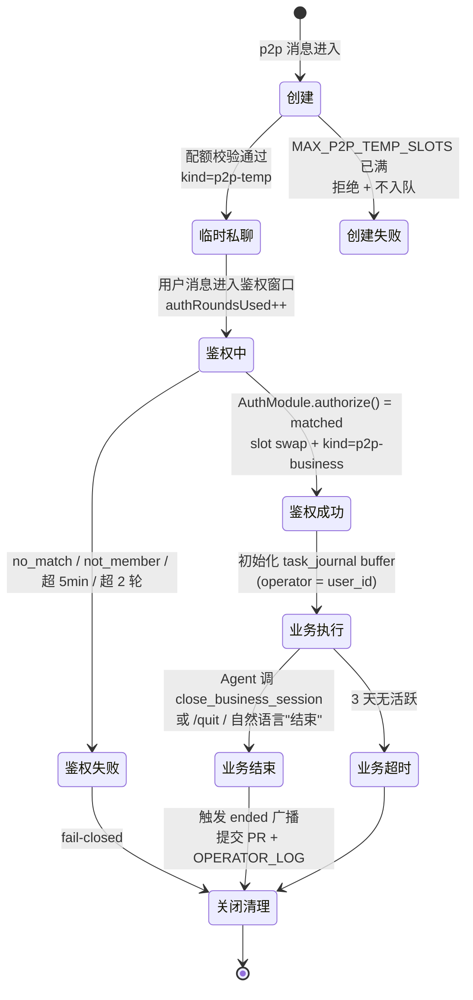
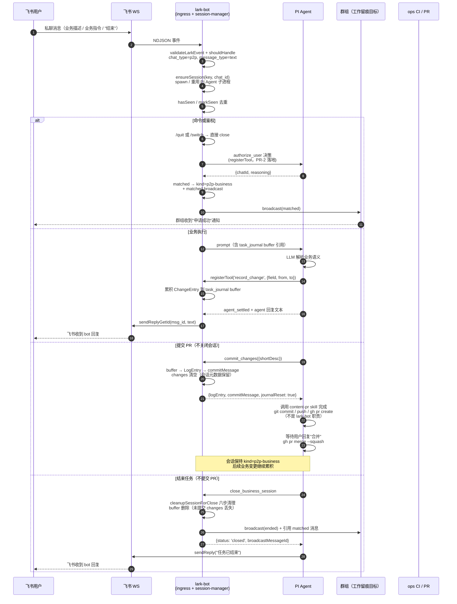
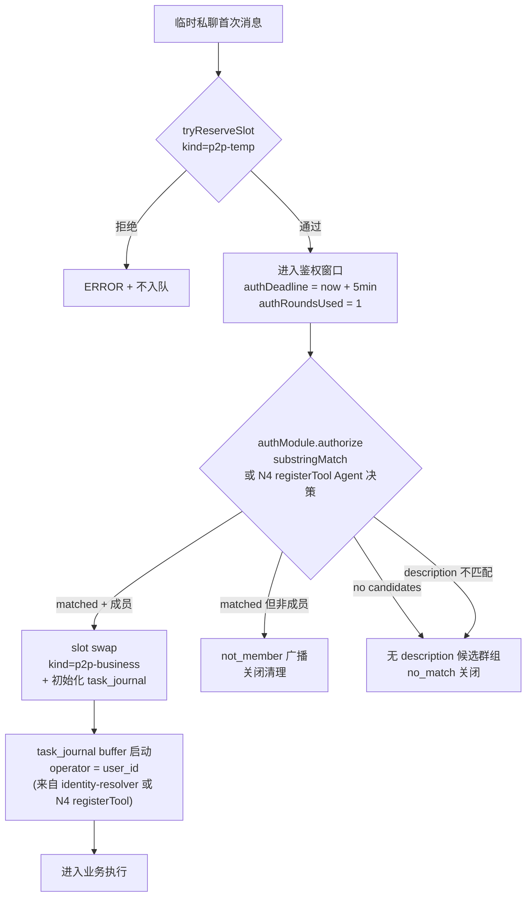
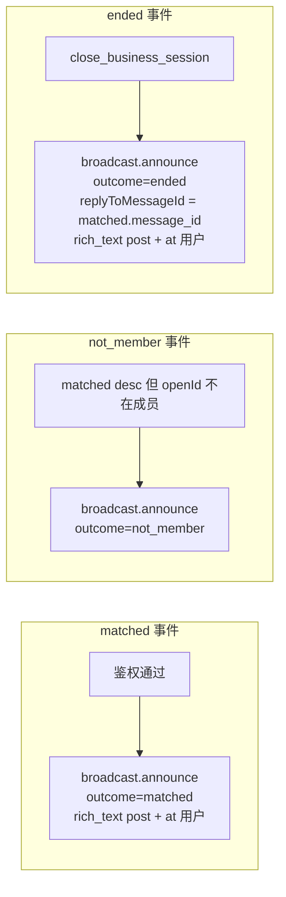
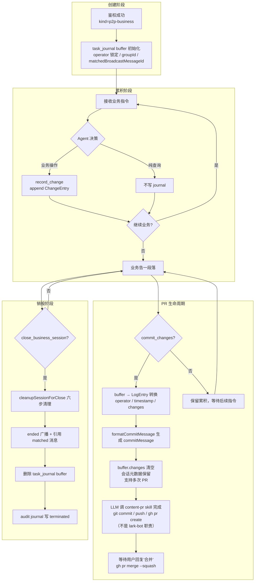

# lark-bot 业务流图（issue #168 第一阶段 N1）

> 与 MVP 设计意图对齐的业务流图。骨架来自 `lark-bot-p2p-business-design.md` §3 七阶段生命周期，业务留痕路径来自 `docs/lark-bot-business-flow.md` 决策 3（走 OPERATOR_LOG）。
> 范围：issue #168 第一阶段产出物 1/6。

## 0. 阅读对象与范围

- 阅读对象：架构重构方案设计者、lark-bot 维护者、Agent 协议设计者。
- 范围：lark-bot 作为飞书私聊接入器的**业务流**。不含飞书协议层 I/O 细节（归 `protocol/feishu.ts`）、不含进程级防护细节（归 `process.ts`）。
- 不在范围：spawn 模式 vs 标准 extension 模式迁移分析（见 N3）、PI Agent 上游契约盘点（见 N2）。

## 1. 核心定位

lark-bot 是 **PI Agent 的 extension（双层架构见 N3 讨论）**，承担三类角色：

| 角色 | 职责 | 当前实现 |
|------|------|---------|
| 飞书私聊接入器 | 飞书 p2p 消息 ↔ PI Agent 双向转发 | `ingress.ts` + `interactive/` |
| 业务私聊鉴权触发器 | 临时私聊 → 业务私聊的鉴权触发与升级 | `business/auth.ts` |
| 工作留痕广播器 | 鉴权 / 关闭事件广播到授权群组 | `business/broadcast.ts` + `broadcast/group-tool.ts` |

## 2. 七阶段生命周期（MVP 骨架）



阶段常量（来自 MVP §6）：

| 常量 | 值 | 含义 |
|------|----|----|
| `MAX_P2P_SESSIONS` | 10 | 全局私聊 session 数量上限 |
| `MAX_P2P_TEMP_SLOTS` | 1 | 临时私聊 session 配额 |
| `MAX_P2P_BUSINESS_SLOTS` | 9 | 业务私聊 session 配额 |
| `P2P_AUTH_TIMEOUT_MS` | 5min | 鉴权窗口超时 |
| `P2P_AUTH_MAX_ROUNDS` | 2 | 鉴权轮次上限 |
| `P2P_IDLE_TIMEOUT_MS` | 3 天 | 业务私聊空闲超时 |

## 3. 端到端业务流（业务私聊会话）



## 4. 群组鉴权工作流



## 5. 工作留痕广播流



模板（来自 `business/broadcast.ts` `renderBroadcastText`）：

| outcome | 模板 |
|---------|------|
| matched | `🔔 [业务私聊] ✅ 用户 <openId> 申请成功（群组：<groupName>）` |
| not_member | `🔔 [业务私聊] ❌ 用户 <openId> 申请失败（群组：<groupName>）：不在成员列表` |
| ended | `🔔 [业务私聊] 🏁 用户 <openId> 申请结束（群组：<groupName>）` |

## 6. 任务日志对象生命周期（业务留痕主路径）

> 这是 MVP 设计意图中**当前缺失**的环节。任务日志对象跨越两个事件边界：
> - 会话生命周期（创建 / 销毁）
> - PR 生命周期（提交）
>
> 两者紧密关联但独立触发。业务私聊会话可跨多次 PR 提交；业务会话关闭不强制提交 PR。

### 6.1 四个生命周期阶段



### 6.2 职责划分

| 阶段 | lark-bot 职责 | content-pr skill 职责 |
|------|--------------|---------------------|
| 创建 | 初始化 buffer / 锁定 operator | — |
| 累积 | 追加 ChangeEntry（larkbot_record_change） | — |
| 提交 | buffer → LogEntry 转换 / 生成 commitMessage | git commit / push / gh pr create / merge |
| 销毁 | cleanupSessionForClose / ended 广播 / buffer 删除 | — |

### 6.3 LogEntry 形态

LogEntry 形态（来自 `agent-src/scripts/op-log-schema.ts`）：

```typescript
interface LogEntry {
  operator: string;        // 飞书稳定 user_id（OPERATOR_REGISTRY 校验）
  timestamp: string;       // ISO 8601
  changes: ChangeEntry[];  // 字段级 diff
}
interface ChangeEntry {
  field: string;           // JSONPath-like: "teams[0].bossHP"
  from: unknown;           // 操作前值（undefined = 新增）
  to: unknown;             // 操作后值（undefined = 删除）
}
```

`OPERATOR_REGISTRY` 真源（来自 `agent-src/scripts/op-log-schema.ts`）：

```typescript
export const OPERATOR_REGISTRY: OperatorRegistry = {
  "38a32652": { name: "weunimix" },
  "311a2ea5": { name: "赤墓" },
};
```

LogEntry 形态（来自 `agent-src/scripts/op-log-schema.ts`）：

```typescript
interface LogEntry {
  operator: string;        // 飞书稳定 user_id（OPERATOR_REGISTRY 校验）
  timestamp: string;       // ISO 8601
  changes: ChangeEntry[];  // 字段级 diff
}
interface ChangeEntry {
  field: string;           // JSONPath-like: "teams[0].bossHP"
  from: unknown;           // 操作前值（undefined = 新增）
  to: unknown;             // 操作后值（undefined = 删除）
}
```

`OPERATOR_REGISTRY` 真源（来自 `agent-src/scripts/op-log-schema.ts`）：

```typescript
export const OPERATOR_REGISTRY: OperatorRegistry = {
  "38a32652": { name: "weunimix" },
  "311a2ea5": { name: "赤墓" },
};
```

## 7. 关闭清理六步清单（统一）

来自 `lark-bot-p2p-business-design.md` §7，所有 session 关闭路径（鉴权失败 / 业务结束 / 业务超时 / 关闭命令）共用：

1. `sessions Map` 删除该 key
2. 杀掉关联的 PI Agent 子进程
3. 清空 session 级缓存（`seenMessageIds` / `activeTask` / `waitingTasks` / `pendingResultFetch`）
4. 写 journal（`emitTaskJournal({state, reason})`）
5. 全局计数 `releaseSlot(kind)`
6. 表情切换 + 飞书回复（协议层动作）

业务私聊关闭额外步骤：

7. 把 task_journal buffer 转换为 LogEntry，返回给 Agent
8. 触发 ended 广播（replyToMessageId = matched.message_id）

## 8. 关键不变量

| 不变量 | 维护位置 | 违反后果 |
|-------|---------|---------|
| 同一 session 同时最多 1 个 activeTask | `task-state-machine.ts` `startTask` | 强制 ERROR 旧任务 + 启动新任务 |
| 鉴权窗口 ≤ 5min | 60s 周期清理器 | 超时关闭 |
| 鉴权轮次 ≤ 2 | `authRoundsUsed++` 触发点 | 超轮关闭 |
| 业务私聊空闲 ≤ 3 天 | 60s 周期清理器 | 超时关闭 |
| task_journal.changes 写入顺序 = Agent 决策顺序 | `record_change` 接收顺序 | journal 顺序反映操作顺序 |
| commit message LogEntry operator 必须在 OPERATOR_REGISTRY | `validateOperatorPermission` | fail-closed 拒绝 PR |

## 9. 与 issue #168 其他节点的关系

| 节点 | 关系 |
|------|------|
| N2 PI Agent 契约盘点 | 本图标注的"PI Agent 决策"节点在 N2 中展开为具体 NDJSON schema |
| N3 spawn vs extension 对比 | 本图的"spawn PI Agent 子进程"步骤在 N3 中评估是否替换为 `registerTool` + `ctx.ui` |
| N4 渐进迁移路线图 | 本图的"鉴权决策 / 关闭意图 / 业务执行"步骤在 N4 中给出 registerTool 接口契约 |
| N5 任务日志 schema | 本图第 6 节为高层生命周期，第 5 节 schema 在 N5 中给出完整字段表 |
| N6 第一阶段汇总 | 本节点是 N6 的组成部分之一 |

## 10. 引用

- `docs/lark-bot-p2p-business-design.md` — 私聊侧 MVP 七阶段生命周期
- `docs/lark-bot-broadcast-business-design.md` — 鉴权 / 广播业务层职责边界
- `agent-src/scripts/op-log-schema.ts` — OPERATOR_LOG 模块（LogEntry / formatCommitMessage / parseLogFromMessage / OPERATOR_REGISTRY）
- `agent-src/scripts/types.ts` — ChangeEntry / LogEntry / DeepDiffResult 类型
- `agent-src/.pi/skills/lark-bot-protocol/SKILL.md` — PI Agent → lark-bot 协议（task_log / close_session）
- `agent-src/.pi/scripts/lark-bot/ingress.ts` — 飞书事件入口实现
- `agent-src/.pi/scripts/lark-bot/interactive/session-manager.ts` — session 生命周期实现
- `agent-src/.pi/scripts/lark-bot/business/auth.ts` — 鉴权判定实现
- `agent-src/.pi/scripts/lark-bot/business/broadcast.ts` — 工作留痕广播实现
