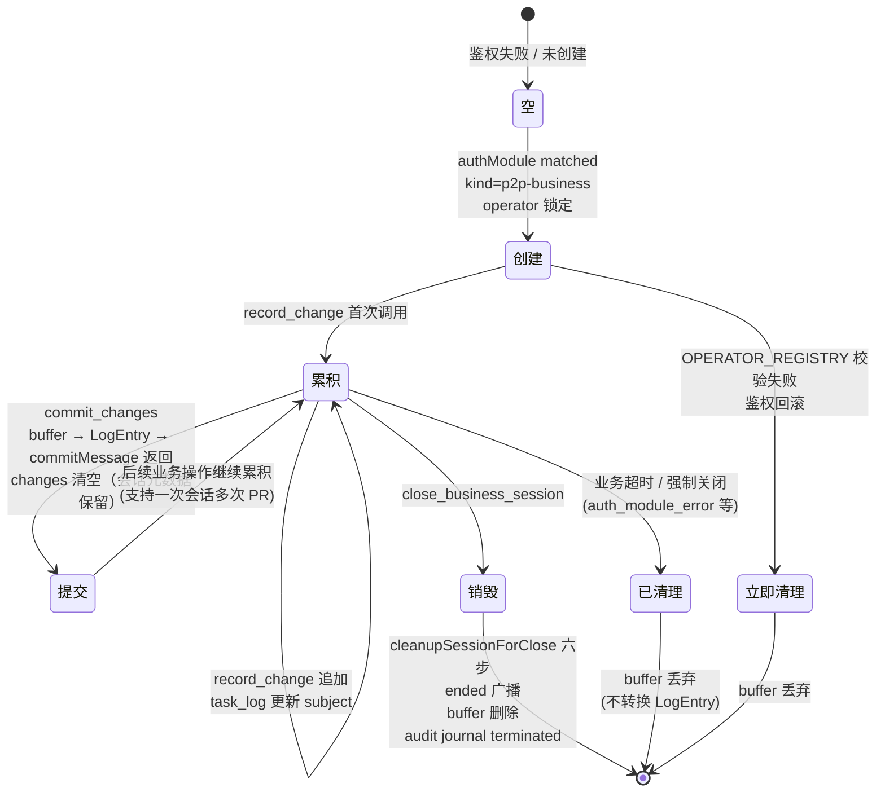

# lark-bot 任务日志对象 Schema（issue #168 第一阶段 N5）

> 与 OPERATOR_LOG 已有基础设施对齐的任务日志对象设计。
> 范围：业务私聊会话开始 → PR 提交之间的累积对象。
> 决策：决策 3（走 OPERATOR_LOG）+ 决策 5（一次会话 = 一次 PR）。

## 0. 阅读对象与范围

- 阅读对象：lark-bot 维护者、Agent 协议设计者、ops CI 维护者。
- 范围：task_journal buffer 对象在 lark-bot 内存中的累积形态；与 `LogEntry` 的转换规则；与 commit message 协议的对接。
- 不在范围：spawn vs extension 迁移分析（见 N3）、PI Agent 上游契约盘点（见 N2）、业务私聊鉴权决策（见 N4）。

## 1. 核心设计

**任务日志 = `LogEntry` 实例 + 累积缓冲（task_journal buffer）**。

- 终态对象（提交到 commit message 时） = `LogEntry`（来自 `agent-src/scripts/op-log-schema.ts`，已实现）
- 累积缓冲（PR 提交前的内存对象） = `task_journal`（本节点新增设计）
- 转换路径：`task_journal` buffer → `LogEntry` → `formatCommitMessage(shortDesc, log)` → commit message

**为什么不直接用 LogEntry 做 buffer**：

- LogEntry 的 `timestamp` 是 ISO 8601 UTC（commit 提交时刻），不是累积开始时刻
- LogEntry 的 `changes` 是最终字段级 diff，但 buffer 阶段可能未计算 from（需要读取 data.json 当前值）
- LogEntry 的 `operator` 在 buffer 启动时已锁定为 user_id，但 buffer 阶段可能需要保留 sender_id 用于降级回查
- buffer 阶段还有 `subject` / `entity` / 业务私聊会话元数据，这些字段不进 commit message（仅供审计 journal 关联）

## 2. task_journal buffer 对象结构

```typescript
/**
 * 业务私聊会话内的任务日志累积缓冲。
 *
 * 生命周期（四个阶段，紧密关联但时机不同）：
 *   创建：鉴权成功（kind=p2p-business）
 *   累积：业务执行中（larkbot_record_change）
 *   提交：PR 提交时（larkbot_commit_changes → buffer → LogEntry → 返回 commitMessage）
 *   销毁：业务私聊关闭时（larkbot_close_business_session）
 *
 * 任务日志对象跨越两个事件边界：
 *   - 会话生命周期（创建 / 销毁）
 *   - PR 生命周期（提交）
 *
 * 提交与销毁不是一步动作（PR 提交可与会话关闭独立触发）。
 *
 * 归属：lark-bot 内存，per-session 持有。
 * 状态：
 *   - 创建后字段全部锁定（operator / groupId 等）
 *   - changes[] 在 commit_changes 后清空，但会话元数据保留（支持多次 PR）
 *   - 会话关闭时整个 buffer 删除
 */
interface TaskJournal {
  /** 鉴权通过的飞书 user_id（OPERATOR_REGISTRY 校验通过） */
  operator: string;
  /** OPERATOR_REGISTRY[operator].name 的缓存（避免热路径回查注册表） */
  operatorName: string | null;
  /** 业务私聊会话开始时刻（业务留痕的"操作时间"起点） */
  sessionStartedAt: string;       // ISO 8601 UTC
  /** 业务私聊会话关联的群组 chat_id（用于 ended 广播） */
  groupId: string;
  /** 业务私聊会话关联的群组名（同上） */
  groupName: string;
  /** matched broadcast 的 message_id（close 时用于引用回复） */
  matchedBroadcastMessageId?: string;
  /** Agent 上报的业务主题（来自 SKILL.md lark-bot-protocol task_log 事件） */
  subject: string | null;
  /** 业务实体维度（race / team / boss / player），用于业务留痕聚合 */
  entity: TaskJournalEntity | null;
  /** 累积的字段级变更（顺序 = Agent 决策顺序） */
  changes: ChangeEntry[];
  /** buffer 启动时刻的 promptId（与 emitTaskJournal 关联） */
  promptId: string;
}

/**
 * 业务实体维度。MVP 阶段由 Agent 在 task_log 上报时推断。
 * 演进：可拆为多实体（一次 PR 可能改多个 entity），但 MVP 假设单实体。
 */
interface TaskJournalEntity {
  /** 业务对象类型：race（赛事）/ team（队伍）/ boss（Boss 进度）/ player（选手） */
  type: "race" | "team" | "boss" | "player";
  /** 业务对象标识（与 RACE_DATA schema 对齐） */
  key: string; // e.g. "t1" / "t1.boss.3" / "BACKSTAGE"
}
```

**字段来源**：

| 字段 | 来源 | 时机 |
|------|------|------|
| `operator` | identity-resolver.ts 或 N4 registerTool `authorize_user` 返回的 user_id | 鉴权成功 |
| `operatorName` | OPERATOR_REGISTRY[operator].name | 同上 |
| `sessionStartedAt` | 鉴权成功时刻 `new Date().toISOString()` | 同上 |
| `groupId` / `groupName` | `authResult.groupId` / `groupName` | 同上 |
| `matchedBroadcastMessageId` | `broadcastModule.announce({outcome:'matched'})` 返回的 `messageId` | 鉴权成功广播后 |
| `subject` | Agent 通过 NDJSON `{type:'task_log', subject}` 上报 | 业务执行中 |
| `entity` | Agent 通过 NDJSON `{type:'task_log', entity}` 上报（**MVP 阶段不强制，可选**） | 同上 |
| `changes[]` | Agent 通过 NDJSON `{type:'task_change', field, from, to}` 上报，或 lark-bot 从 Prompt 反推 | 业务执行中 |
| `promptId` | 鉴权成功后首条消息的 promptId | 鉴权成功 |

## 3. ChangeEntry 字段对齐

完全复用 `agent-src/scripts/types.ts` `ChangeEntry`：

```typescript
interface ChangeEntry {
  field: string;   // JSONPath-like: "teams[0].bossHP"、"news[2].text"
  from: unknown;   // undefined = 新增
  to: unknown;     // undefined = 删除
}
```

**MVP 已有的校验规则**（`validateLogStructure`）：

- `field` 必填且为 string
- `from` / `to` 必填字段存在（值可为 undefined / null / 任意 JSON）
- `changes` 非空数组

**新增约束**（lark-bot 累积阶段）：

- `from` 必须是 data.json 当前实际值（不允许 Agent 推断）
- 同一字段多次变更应保留所有版本（顺序 = 决策顺序）

## 4. task_journal → LogEntry 转换规则

转换发生在 `larkbot_commit_changes` registerTool 调用时：

```typescript
import { generateLog, formatCommitMessage } from "../../scripts/op-log-schema.js";

function taskJournalToLogEntry(journal: TaskJournal): LogEntry {
  return generateLog(journal.operator, journal.changes);
}

function commitChanges(journal: TaskJournal, shortDesc: string): {
  logEntry: LogEntry;
  commitMessage: string;
} {
  const logEntry = taskJournalToLogEntry(journal);
  const commitMessage = formatCommitMessage(shortDesc, logEntry);
  return { logEntry, commitMessage };
}
```

**转换语义**：

- `operator` 直接透传（已在 buffer 启动时锁定）
- `timestamp` 由 `generateLog` 自动填充 `new Date().toISOString()`
- `changes` 直接透传
- `shortDesc` 由 Agent 在 `larkbot_commit_changes` 调用时提供（见 §6 来源说明）

**operator 校验时机**：

- buffer 启动时：`isOperatorAllowed(operator)` 必须为 true（fail-closed）
- 转换时：`validateOperatorPermission(logEntry)` 由 ops CI 在 PR 合并前再次校验
- 失败处理：lark-bot 拒绝 `larkbot_commit_changes` + 提示用户；ops CI 拒绝合并 PR

## 5. buffer 生命周期（与任务日志对象生命周期对齐）

任务日志对象有四个生命周期阶段，跨越两个事件边界：

```
[会话生命周期]                                          [PR 生命周期]
   创建                                                  提交
    ↓                                                    ↓
初始化 → 累积中 → commit_changes → 累积中 → ... → close_business_session → 已清理
              ↑                                                    ↓
              └── record_change（多次）                              buffer 删除
                                                                  audit journal terminated
```



**关键不变量**：

- `changes` 数组顺序 = Agent 决策顺序（lark-bot 不重排序）
- buffer 启动后 `operator` 不变（即使 sender 变更）
- `commit_changes` 后 `changes[]` 清空，但 `operator` / `groupId` / `matchedBroadcastMessageId` 等会话元数据保留
- `close_business_session` 后整个 buffer 删除
- 业务超时 / 强制关闭不转换 LogEntry（buffer 丢弃）
- 一次业务私聊会话**支持多次 PR 提交**——每次 commit_changes 产生一个 LogEntry

## 6. 字段来源（待你裁决项）

### 6.1 shortDesc 来源（commit message 第一行）

`formatCommitMessage(shortDesc, log)` 的 shortDesc 决定 PR 标题，需明确：

| 候选 | 说明 | 取舍 |
|------|------|------|
| Agent 推断 | Agent 在 close_business_session 调用时根据 changes 总结 | 灵活但不可控 |
| subject 复用 | 直接用 buffer.subject（来自 task_log 上报） | 一致但过于简略 |
| 用户原话 | 业务私聊首条消息原文 | 真实但可能冗长 |
| 复合 | `subject + 主要 change 摘要` | 推荐，需 Agent 拼接 |

**MVP 建议**：复合形式，Agent 在 close 调用时拼接。MVP 阶段不强制 schema，由 Agent 决定。

### 6.2 subject vs entity 关系

- `subject` 自由文本（"更新 t1 bossHP 15.0 → 12.5"），用于业务留痕 grep
- `entity` 结构化字段（`{type:'team', key:'t1'}`），用于业务留痕聚合

MVP 建议两者并存：
- `subject` 由 Agent 上报时填（可选）
- `entity` 由 Agent 上报时填（可选）
- LogEntry 转换时不包含 `subject` 和 `entity`（仅进 audit journal）

### 6.3 operator 来源（决策点）

当前 MVP 中：

- `task.operator = event.sender_id`（占位为 open_id）
- identity-resolver.ts 未被调用（孤儿模块）

N4 registerTool `larkbot_authorize_user` 落地后：

- Agent 拿到 candidates 列表，决策后调 `larkbot_authorize_user({openId, chatId})`
- lark-bot 在 `larkbot_authorize_user` 内部调用 identity-resolver 解析 open_id → user_id
- user_id 写入 buffer.operator
- buffer 启动时校验 `isOperatorAllowed(operator)`

## 7. 失败模式

| 失败场景 | 触发时机 | 处理 |
|---------|---------|------|
| OPERATOR_REGISTRY 校验失败 | buffer 启动时 operator 不在注册表 | buffer 立即清理 + 鉴权回滚 + ERROR 表情 |
| Agent 业务执行期间异常 | record_change 解析失败 / 字段路径非法 | 当前 ChangeEntry 拒绝追加 + ERROR 日志，不阻断后续 record_change |
| task_journal.changes 为空 | commit_changes 调用时 | **不允许提交**（validateLogStructure 校验 changes 非空）；提示 Agent 必须有业务变更 |
| 业务超时 / 强制关闭 | 60s 周期清理器 / 鉴权失败 | **buffer 丢弃**（未转换 LogEntry）；audit journal 写入 terminated reason |
| PR 提交失败 | ops CI 拒绝合并 / content-pr skill 报错 | audit journal 写 `{state:'terminated', reason:'pr_rejected', prUrl?}`；该事件由 ops CI 反馈触发，不在 lark-bot 主动写入范围内 |
| OPERATOR_REGISTRY 与 sender 身份不一致 | identity-resolver 解析的 user_id 与飞书实际 sender 关联失败 | 关闭会话 + 广播 ended + audit journal 写 `{state:'terminated', reason:'operator_resolution_failed'}` |

**state 字段取值约定**：

- 当前文档使用的合法值：`in_progress` / `awaiting_review` / `post_review` / `terminated`
- `pre_business` / `in_progress` 当前未在任何 emit 点使用（待业务扩展时补齐）
- 同一种 state 通过 `reason` 字段表达不同语义：
  - `terminated` + `reason='session_closed'`
  - `terminated` + `reason='pr_rejected'`
  - `terminated` + `reason='operator_resolution_failed'`

## 8. 与 audit journal 双写策略

**audit journal**（`/tmp/lark-bot-tasks.jsonl`，`emitTaskJournal`）当前是审计日志（每个 task 状态跃迁一条记录）。

**新增 task_journal 业务留痕**（转换后的 LogEntry 进 commit message + ops CI 落盘）。

| 维度 | audit journal | task_journal business |
|------|--------------|---------------------|
| 用途 | 任务状态跃迁审计（开发排障） | 业务留痕（运营审计 / 合规） |
| 字段 | eventTime, promptId, operator, state, subject, durationMs, reason | operator, timestamp, changes |
| 持久化 | /tmp/lark-bot-tasks.jsonl（lark-bot 进程级） | commit message → git history（永久） |
| 生命周期 | task 状态跃迁即写 | close_business_session 转换 |
| 解析 | 运维手 grep | `parseLogFromMessage(commitMsg)` |

**双写策略**（与 PR-4 拆分后一致）：

```
larkbot_commit_changes 成功时：
  1. task_journal → LogEntry 转换
  2. 双写：
     - audit journal 写一条 {state:'awaiting_review', shortDesc, changesCount}
     - LogEntry + commitMessage 返回 LLM
  3. LLM 调 content-pr skill 提交 commit message

larkbot_close_business_session 时：
  1. cleanupSessionForClose 六步
  2. audit journal 写一条 {state:'terminated', reason}
  3. 删除 buffer
  4. 触发 ended 广播

不属于 lark-bot 范畴（由 ops CI / content-pr skill 反馈）：
  - PR 合入：audit journal 写 {state:'post_review', prUrl, mergedAt}
  - PR 拒绝：audit journal 写 {state:'terminated', reason:'pr_rejected', prUrl?}
```

## 9. 与 SKILL.md task_log 上报的协调

**当前 SKILL.md lark-bot-protocol 协议**（`agent-src/.pi/skills/lark-bot-protocol/SKILL.md`）：

- Agent 在理解任务主题后 emit `{type:'task_log', promptId, subject}`
- lark-bot `handleTaskLog` 用 promptId 定位 task，写 journal

**扩展建议**（N5 范围内提议）：

新增 NDJSON 事件类型：

```typescript
// PI Agent → lark-bot
interface TaskChangeEvent {
  type: "task_change";
  promptId: string;
  field: string;      // JSONPath-like
  from: unknown;
  to: unknown;
}
```

`task_change` 与 `task_log` 的差异：

- `task_log` 上报业务主题（subject），用于审计
- `task_change` 上报字段级变更（changes[]），用于业务留痕

**MVP 阶段策略**：

- `task_log` 已实现（保持向后兼容）
- `task_change` 新增（PI Agent 实现协议扩展后启用）
- 渐进启用：先在 SKILL.md 注释中说明，PI Agent 准备好后再激活

## 10. 与 PR / commit message 协议集成

**职责划分**：

| 阶段 | 职责 | 实现 |
|------|------|------|
| buffer → LogEntry 转换 | lark-bot | `larkbot_commit_changes` registerTool |
| commit message 生成 | lark-bot | `formatCommitMessage(shortDesc, log)` |
| git commit / push / gh pr create / merge | PI Agent (content-pr skill) | `agent-src/.pi/skills/content-pr/SKILL.md` |
| commit message 校验 | ops CI | `agent-src/scripts/validate-op-log.ts` |

**集成路径**：

```
业务会话中 LLM 调 larkbot_commit_changes({shortDesc})
  → lark-bot 校验 buffer.changes 非空 + operator 在 OPERATOR_REGISTRY
  → buffer → LogEntry 转换
  → formatCommitMessage(shortDesc, log) 生成 commitMessage
  → buffer.changes 清空（会话元数据保留）
  → 返回 {logEntry, commitMessage} 给 LLM

LLM 拿到 commitMessage 后调 content-pr skill
  → content-pr skill 负责：
    - git checkout -b content/<操作>-<目标>
    - 修改 data.json
    - git commit -m commitMessage（包含 4反引号 JSON 块）
    - git push
    - gh pr create --base main
    - 等待用户回复"合并"
    - gh pr merge --squash --delete-branch

ops CI 校验（PR 合并前）
  → validate-op-log.ts 提取 commit message 4反引号 JSON 块
  → parseLogFromMessage(commitMsg) 提取 LogEntry
  → validateOperatorPermission 校验 operator 在 OPERATOR_REGISTRY
  → validateLogStructure 校验结构完整
  → PR 合并入 main
  → git history 永久保存 LogEntry
```

**关键边界**：

- lark-bot **不持有 git 权限**，不调 gh CLI
- content-pr skill **不持有业务会话状态**，仅消费 commitMessage
- 任务日志对象**仅在 lark-bot 内存中存在**，转换后即销毁 buffer（changes 清空）
- LogEntry 一旦嵌入 commit message，永久保存在 git history，与 lark-bot 重启 / 会话关闭无关
- 校验 commit message 是否含 LogEntry JSON 块
- 校验 operator 必须在 OPERATOR_REGISTRY
- 校验 changes 非空

**新增校验需求**：

- `validateOperatorPermission` 当前仅校验 operator 在注册表，不校验与 OPERATOR_REGISTRY 的其他约束（如是否在职）
- 建议保持当前实现（MVP 不引入额外业务规则），未来需要时扩展

## 11. 测试覆盖建议

| 测试类型 | 覆盖点 | 状态 |
|---------|--------|------|
| 单元测试 | `taskJournalToLogEntry` 转换正确性 | 新增（PR-4） |
| 单元测试 | `closeBusinessSession` 在 changes 为空时拒绝 | 新增（PR-4） |
| 单元测试 | buffer 启动时 operator 校验失败 → 立即清理 | 新增（PR-4） |
| 单元测试 | record_change 字段路径非法处理 | 新增（PR-4） |
| 集成测试 | close_business_session → audit journal 双写 | 新增（PR-4） |
| 集成测试 | close_business_session → Agent 嵌入 commit message → ops CI 校验通过 | 新增（PR-4） |
| 回归测试 | identity-resolver 未被调用（孤儿） | 删除（PR-1） |
| 回归测试 | emitTaskJournal 仅审计，不混淆业务留痕 | 保留 + 新增文档说明 |

## 12. 与 issue #168 其他节点的关系

| 节点 | 关系 |
|------|------|
| N1 业务流图 | 本节点是 N1 §6 任务日志对象生命周期的详细 schema 定义 |
| N2 PI Agent 契约盘点 | 本节点 §9 提议的 `task_change` 事件需在 N2 中纳入 PI Agent 契约 |
| N3 spawn vs extension 对比 | 本节点不受迁移影响（无论哪种架构，task_journal buffer 都在 lark-bot 内存） |
| N4 渐进迁移路线图 | 本节点对应 N4 中 PR-4 的产出；`larkbot_authorize_user` registerTool 是 PR-2 范围；本节点是 PR-4 范围 |
| N6 第一阶段汇总 | 本节点是 N6 的组成部分之一 |

## 13. 引用

- `docs/lark-bot-business-flow.md`（N1）— 任务日志对象生命周期图
- `agent-src/scripts/op-log-schema.ts` — LogEntry / ChangeEntry / generateLog / formatCommitMessage / parseLogFromMessage / validateOperatorPermission / validateLogStructure
- `agent-src/scripts/types.ts` — ChangeEntry / LogEntry / OperatorRegistry / OperatorRegistryEntry
- `agent-src/scripts/validate-op-log.ts` — ops CI 校验脚本（PR 合并前）
- `agent-src/scripts/__tests__/op-log-schema.test.ts` — 单元测试
- `agent-src/scripts/__tests__/validate-op-log.test.ts` — 校验脚本测试
- `agent-src/.pi/scripts/lark-bot/identity-resolver.ts` — operator 解析（当前孤儿，PR-2 激活）
- `agent-src/.pi/skills/lark-bot-protocol/SKILL.md` — PI Agent → lark-bot NDJSON 协议
- `agent-src/.pi/scripts/lark-bot/business/broadcast.ts` — 工作留痕广播
- `docs/lark-bot-p2p-business-design.md` — 私聊侧 MVP（七阶段生命周期）
